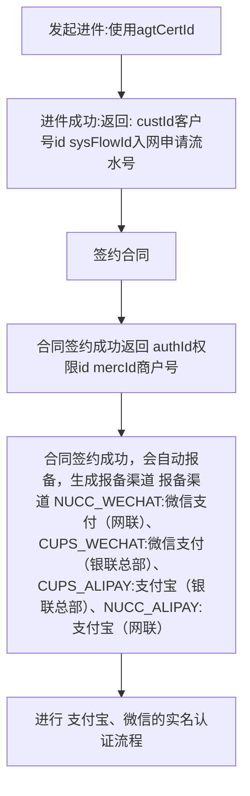
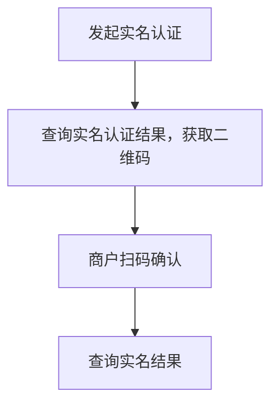

# 银盛Golang SDK

## 进件流程

```mermaid
flowchart TB

    a[发起进件:使用agtCertId] -->
    b[进件成功:返回: custId客户号id sysFlowId入网申请流水号] -->
    c[签约合同] -->
    d[合同签约成功返回 authId权限id mercId商户号] -->
    e[合同签约成功，会自动报备，生成报备渠道 报备渠道 NUCC_WECHAT:微信支付（网联）、CUPS_WECHAT:微信支付（银联总部）、CUPS_ALIPAY:支付宝（银联总部）、NUCC_ALIPAY:支付宝（网联）] -->
    f[进行 支付宝、微信的实名认证流程]
```

## 微信/支付宝 实名认证

```mermaid
flowchart TB

a[发起实名认证] -->
b[查询实名认证结果，获取二维码] --> 
c[商户扫码确认] -->
d[查询实名结果]
```